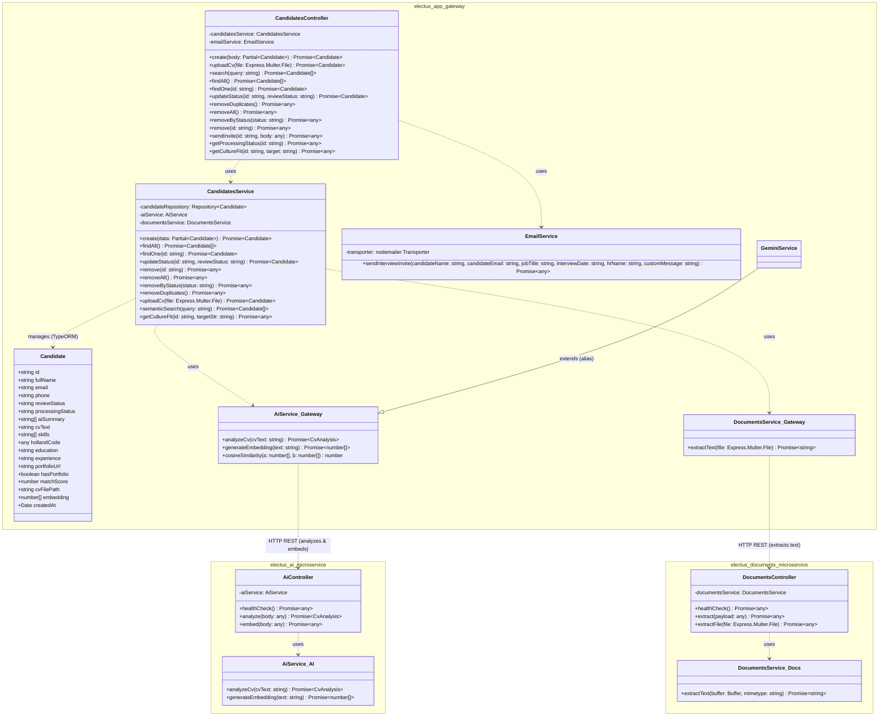

# Class Diagram: Electus Backend Architecture

This class diagram represents the actual class structures, dependencies, properties, and methods implemented in the Electus NestJS backend.

---

```mermaid
classDiagram
  %% Relations
  CandidatesController ..> CandidatesService : uses
  CandidatesController ..> EmailService : uses
  CandidatesService ..> Candidate : manages (TypeORM)
  CandidatesService ..> AiService_Gateway : uses
  CandidatesService ..> DocumentsService_Gateway : uses
  GeminiService --|> AiService_Gateway : extends (alias)
  
  AiController ..> AiService_AI : uses
  DocumentsController ..> DocumentsService_Docs : uses

  AiService_Gateway ..> AiController : HTTP REST (analyzes & embeds)
  DocumentsService_Gateway ..> DocumentsController : HTTP REST (extracts text)

  %% Service Groups
  namespace electus_app_gateway {
    class Candidate {
      +string id
      +string fullName
      +string email
      +string phone
      +string reviewStatus
      +string processingStatus
      +string[] aiSummary
      +string cvText
      +string[] skills
      +any hollandCode
      +string education
      +string experience
      +string portfolioUrl
      +boolean hasPortfolio
      +number matchScore
      +string cvFilePath
      +number[] embedding
      +Date createdAt
    }

    class CandidatesController {
      -candidatesService: CandidatesService
      -emailService: EmailService
      +create(body: Partial~Candidate~) Promise~Candidate~
      +uploadCv(file: Express.Multer.File) Promise~Candidate~
      +search(query: string) Promise~Candidate[]~
      +findAll() Promise~Candidate[]~
      +findOne(id: string) Promise~Candidate~
      +updateStatus(id: string, reviewStatus: string) Promise~Candidate~
      +removeDuplicates() Promise~any~
      +removeAll() Promise~any~
      +removeByStatus(status: string) Promise~any~
      +remove(id: string) Promise~any~
      +sendInvite(id: string, body: any) Promise~any~
      +getProcessingStatus(id: string) Promise~any~
      +getCultureFit(id: string, target: string) Promise~any~
    }

    class CandidatesService {
      -candidateRepository: Repository~Candidate~
      -aiService: AiService
      -documentsService: DocumentsService
      +create(data: Partial~Candidate~) Promise~Candidate~
      +findAll() Promise~Candidate[]~
      +findOne(id: string) Promise~Candidate~
      +updateStatus(id: string, reviewStatus: string) Promise~Candidate~
      +remove(id: string) Promise~any~
      +removeAll() Promise~any~
      +removeByStatus(status: string) Promise~any~
      +removeDuplicates() Promise~any~
      +uploadCv(file: Express.Multer.File) Promise~Candidate~
      +semanticSearch(query: string) Promise~Candidate[]~
      +getCultureFit(id: string, targetStr: string) Promise~any~
    }

    class AiService_Gateway {
      +analyzeCv(cvText: string) Promise~CvAnalysis~
      +generateEmbedding(text: string) Promise~number[]~
      +cosineSimilarity(a: number[], b: number[]) number
    }

    class GeminiService {
      %% Inherits all methods of AiService
    }

    class DocumentsService_Gateway {
      +extractText(file: Express.Multer.File) Promise~string~
    }

    class EmailService {
      -transporter: nodemailer.Transporter
      +sendInterviewInvite(candidateName: string, candidateEmail: string, jobTitle: string, interviewDate: string, hrName: string, customMessage: string) Promise~any~
    }
  }

  namespace electus_ai_microservice {
    class AiController {
      -aiService: AiService
      +healthCheck() Promise~any~
      +analyze(body: any) Promise~CvAnalysis~
      +embed(body: any) Promise~any~
    }

    class AiService_AI {
      +analyzeCv(cvText: string) Promise~CvAnalysis~
      +generateEmbedding(text: string) Promise~number[]~
    }
  }

  namespace electus_documents_microservice {
    class DocumentsController {
      -documentsService: DocumentsService
      +healthCheck() Promise~any~
      +extract(payload: any) Promise~any~
      +extractFile(file: Express.Multer.File) Promise~any~
    }

    class DocumentsService_Docs {
      +extractText(buffer: Buffer, mimetype: string) Promise~string~
    }
  }
```
